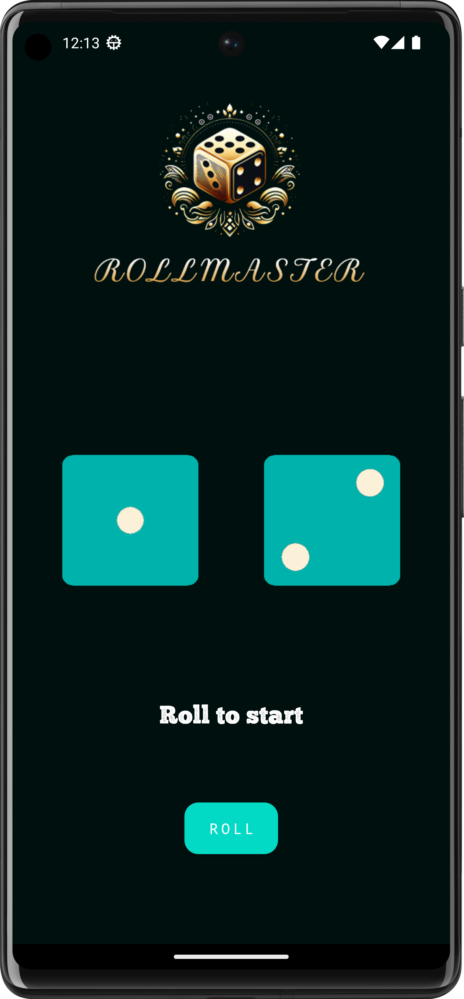
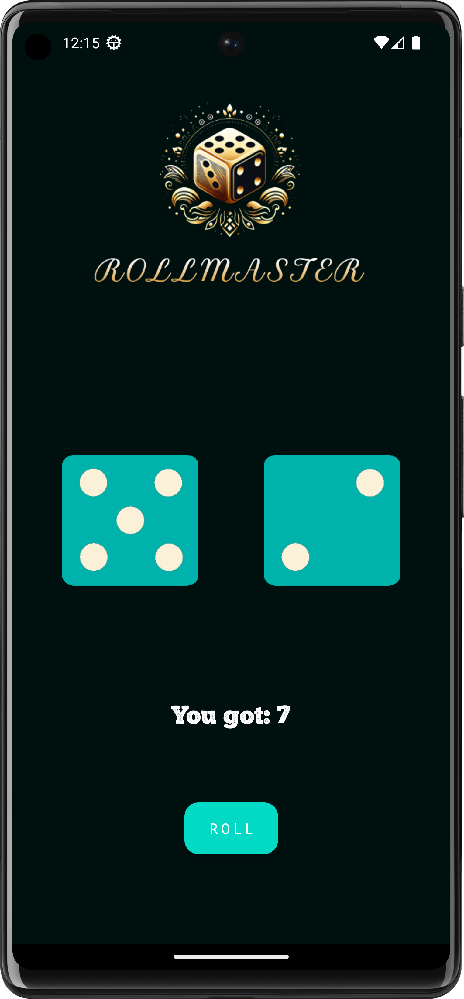

# RollMaster
A Dice Rolling Android App.

Rollmaster is an Android application I developed as part of my learning journey with Android Studio. The app serves as a handy tool for board game enthusiasts, especially when traditional dice are not readily available. With Rollmaster, users can simulate the roll of dice with a simple tap, providing random results that mimic the unpredictability of physical dice rolls. This app comes in handy during board game sessions, eliminating the need to search for or carry physical dice. Its user-friendly interface and straightforward functionality make Rollmaster a useful companion for any gaming occasion, ensuring a seamless and enjoyable experience for players engaging in games that involve chance and dice.

**Screenshots** 
       

**Video**
[!Video](videos)

